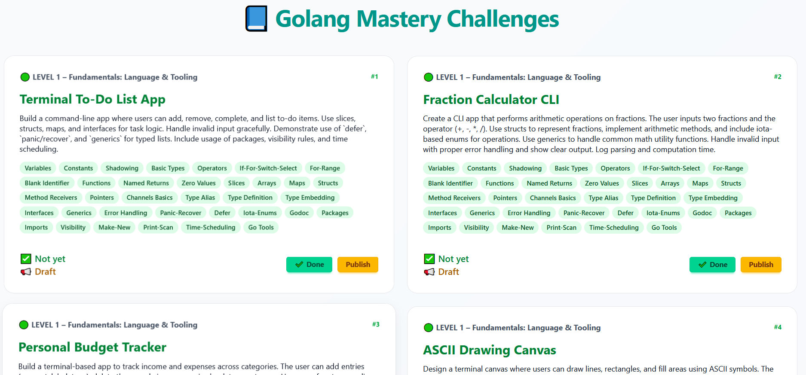

# Todo web app to learn Golang
## By : ilyas ouzrour

This is a simple web app that contain projects to do if you want to switch from newbie to pro level in go !


## Screenshots



## how to run it 

```cmd
npm i
npm i -g nodemon
nodemon app.js
```
